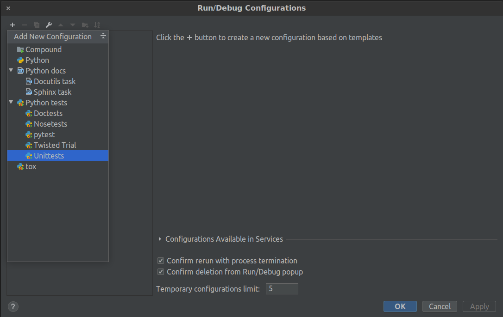
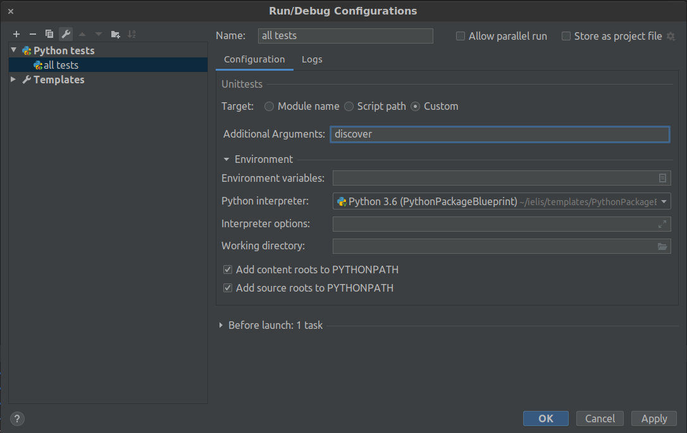

# PythonPackageBlueprint
Template for a Python package

## Install setuptools
Python packages are managed by `setuptools` library which is usually pre-installed in Python virtual environment.
Check that the library is installed in your Python by running
```bash
pip show setuptools
```

and install the library if it is not present by running

```bash
pip install setuptools
```

## The `setup.py` file

The root directory of the package contains file `setup.py` which describes package building process, dependencies, 
and metadata.

## The `requirements.txt` file

This file contains names and versions the Python packages which your package depends on. 
This example uses `pysam` to fast random access to indexed Fasta file.

## Install the package

We install the package including requirements by running:
```bash
# enter the project directory
cd PythonPackageBlueprint

# install the package 
pip install .

# test that the installation worked
pypablue --help
```

## Command line interface

We can make the package to define a command line interface (CLI) by adding `console_scripts` to `entry_points` option 
within `setup.py`. In this project, CLI is defined in `pypablue.main`.

We can try the CLI out if the package has been installed:
```bash
pypablue --help
pypablue fasta fetch chrM:1-10 path/to/genome.fa
```

## Unit tests

During the build process, unit tests are automatically found and run as long as they are located at the expected location.
By default, Python test files are expected to be named `test_*`.

- in order to run all tests manually within terminal, run

  ```bash
  cd PythonPackageBlueprint
  python -m unittest discover
  ```
  > the `discover` option will look for tests in current directory and all subdirectories 

- in order to run all tests within PyCharm, create a run configuration:
  
  
  > after clicking on the *+* icon, add `Unittests` configuration

  
  > rename the new configuration to e.g. `all tests`, select `Custom` bullet point, and type `discover` into 
  > the *Additional arguments* field

